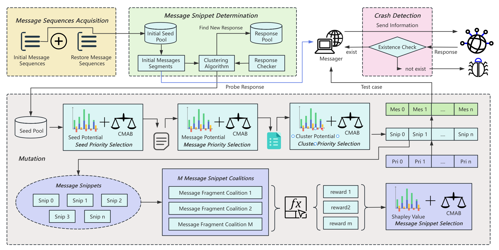

# SnipleyFuzz

SnipleyFuzz is a priority-based, response-oriented black-box fuzzing framework for IoT devices. It assumes no firmware or code coverage information, and instead builds a network–interaction–level feedback loop over message snippets, using:

- Novel Response State (NRS) as a protocol-agnostic feedback signal,
- Shapley-value–based snippet attribution to quantify each snippet’s contribution to NRS,
- Contextual Multi-Armed Bandit (CMAB) with linear UCB to schedule snippet mutations under non-stationary, noisy responses,
- Time-windowed NRS measurement (W) and replay budget (K) for robustness.

## Overview of SnipleyFuzz



## Instructions for running this tool

``````bash
usage: snipleyfuzz.py [-h] --restorefile RESTOREFILE --outputfold OUTPUTFOLD --inputfold INPUTFOLD --devicetype DEVICETYPE --devicename DEVICENAME
                      (--recordfile RECORDFILE | --probefold PROBEFOLD)

IoT Fuzz main program: specify paths for restorefile, inputfold, outputfold, probe_fold, recordfile, device_type, and device_name. Use -h/--help to see all options.

options:
  -h, --help            show this help message and exit
  --restorefile RESTOREFILE
                        Path to the restore seed file.
  --outputfold OUTPUTFOLD
                        Directory for storing crash samples.
  --inputfold INPUTFOLD
                        Directory of initial seed inputs.
  --devicetype DEVICETYPE
                        Device type (e.g., 'yeelight', 'xiaomi'); passed to Messenger for low-level communication.
  --devicename DEVICENAME
                        Device name (e.g., 'YLDP05YL', 'YLDP13YL'); passed to construct the output file name.
  --recordfile RECORDFILE
                        Probe record file path; if exists, Probe phase will be skipped.
  --probefold PROBEFOLD
                        Directory to store Probe-phase record files.
``````

## Publication

The design and implementation of **SnipleyFuzz** are described in the following paper, which has been accepted by the **56th Annual IEEE/IFIP International Conference on Dependable Systems and Networks (DSN 2026)**.

> **SnipleyFuzz: Enhancing Black-Box Fuzzing of IoT Devices with Shapley-Based Priority Selection.**  
> Accepted at **DSN 2026**.

For the official list of accepted papers, please refer to:

https://dsn2026.github.io/cpaccepted.html

If you use **SnipleyFuzz** in your research, please consider citing our paper. A BibTeX entry will be provided after the proceedings are published.
